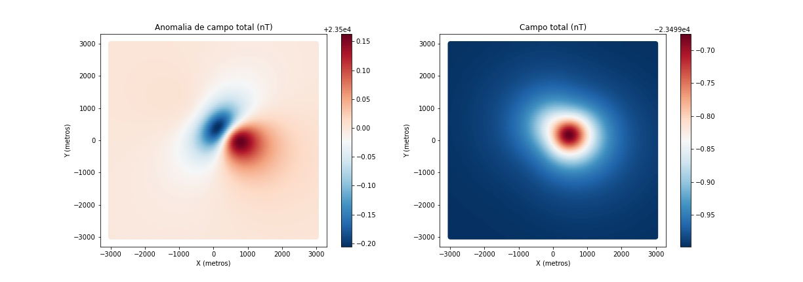
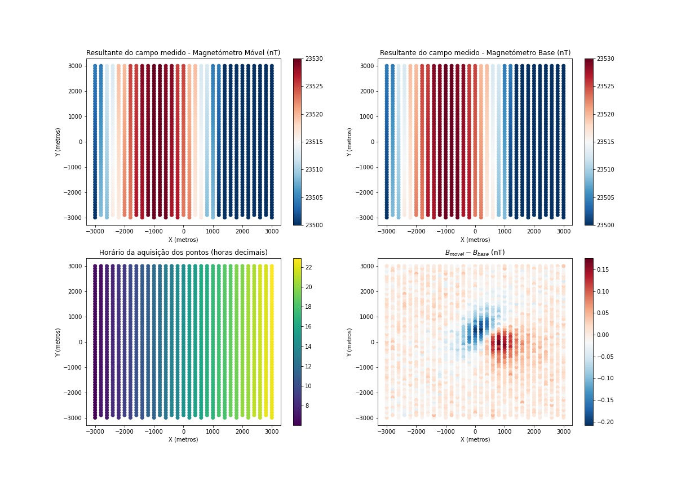

### Estudo do IGRF e das variações diurnas para reduções magnéticas
Souza, Gustavo. Araujo, Rodrigo.

&nbsp;

 Simulação computacional de uma aquisição geofísica de magnetometria. Dados artificais em função do tempo. Modelagem de um dipolo magnético dentro de uma esfera. Modelagem de uma variação diurna sintética com ruído numérico. Modelagem de um campo regional. Redução da variação diurna. Redução do campo geomagnético utilizando IGRF. 

 Prova P2 - Gravimetria e Magnetometria 2020.1 (quinto período da Graduação em em Geofísica da Universidade Federal Fluminense). O material apresentado neste documento é fruto de integral dedicação e comprometimento dos autores listados acima. Qualquer cópia de imagens, figuras esquemáticas, informações e resultados sem qualquer menção aos idealizadores pode ser configurar o plágio. 

&nbsp;

 Para a realização desse estudo foi utilizado um pacote de funções (funcoes_campo.py) cedido pelo professor Rodrigo Bijani da Universidade Federal Fluminense. 

